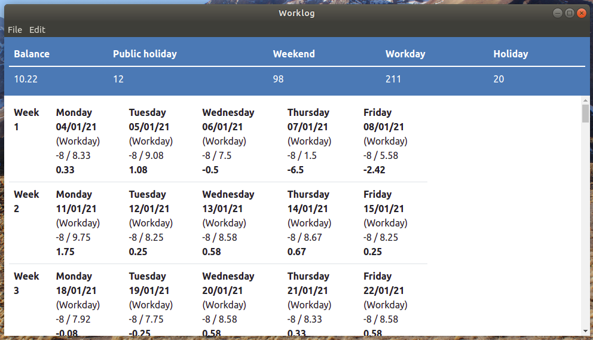

# Utility.Worklog

> Track your working hours, spent on projects, only with a text editor.

You can track your working hours and public holidays in csv files and calculate your working hour balance with this tool. This allows you to easily version your worklog by git or edit syncronized worklog files on your phone by a simple text editor.




## Usage

### Example setup

`~/Documents/Admin/2021-worklog.csv`:

```csv
Day,Start,End,Project,Task
01/01/21,09:00,12:00,Worklog utility,Basic worklog functionality
01/01/21,13:00,18:00,Worklog utility,Calendar support
```

`~/Documents/Admin/2021-worklog.calendar.csv`:

```csv
# Type: Public holiday | Sick day | Holiday | Unpaid holiday | Unpaid leave
Day,Quantity,Type
02/01/21,1,Public holiday
```

`~/Documents/Admin/2021-worklog.config.json`:

```json
{
    "workingHoursPerDay": 8,
    "startDay": "01/01/21",
    "endDay": "31/01/21"
}
```


## Development

### Installation

1. Install [Node.js](https://nodejs.org/en/)
2. Install [Yarn](https://yarnpkg.com/lang/en/docs/install/)
3. [Clone source](https://github.com/moonline/Utility.Worklog/archive/master.zip)
4. Install dependencies 

   ```sh
   cd release-x.y
   yarn install
   ```
5. Start

```sh
npm start
```